# オーナー向け 運用マニュアル

このお店の LINE 公式アカウントは、お客様からのよくある問い合わせ（営業時間・料金・
アクセス・予約など）に**自動で返信**します。このマニュアルは、そのお店の**オーナー
自身**が、スマホだけで日々の管理（よくある質問の登録、お知らせの一斉配信、
「要対応」の対応など）をできるようにするためのものです。

- 専門的な知識は必要ありません。パソコンも使いません。
- 手順どおりに進めれば、ほとんどのことはご自身で対応できます。
- 手に負えないことは「構築担当者」（このアプリを作った人）に連絡します。
  連絡先は「0. まず読む」に書き込んでおいてください。

> 画面写真は本文中に差し込んであります。まだ差し込んでいない4か所（Android の
> 「ホーム画面に追加」／ログの一覧／LINE公式アカウントの「チャット」／配信完了の表示）は
> `📷` の印のまま残してあります。写真の一覧は「付録A」。

**関連ドキュメント（構築担当者向け・オーナーは読まなくて構いません）**

| ドキュメント                                | 内容                                    |
| ------------------------------------------- | --------------------------------------- |
| [`README.md`](../README.md)                 | プロジェクトの概要・技術構成            |
| [`docs/SETUP.md`](./SETUP.md)               | 同じ仕組みを1から作る手順               |
| [`docs/ARCHITECTURE.md`](./ARCHITECTURE.md) | 技術的な仕様（API・データベース・連携） |

---

## 0. まず読む

手を動かす前に、**ご自身が何を担当するのか**を確認してください。

### この仕組みでできること

- お客様が LINE で「営業時間は？」「カットいくら？」などと送ると、登録された情報を
  もとに**自動で返信**します。
- 自動でうまく答えられなかったときは、**オーナーの LINE に「要対応」の通知**が届きます。
- オーナーは管理画面から、**よくある質問（FAQ）・メニュー・料金**を編集できます。
- 友だち登録しているお客様全員に、**お知らせを一斉配信**できます（臨時休業など）。

### あなた（オーナー）がやること

1. **よくある質問と答えを登録・更新する**（→ 2章）
   自動返信の内容は、ここに登録したものが元になります。
2. **「要対応」の通知が来たら、自分でお客様に連絡する**（→ 5章）
   自動で答えられなかった問い合わせは、オーナーが直接対応します。
3. **臨時休業などのお知らせを一斉配信する**（→ 7章）
4. **自動返信がおかしいと気づいたら直す**（→ 6章）

### あなたがやらなくていいこと（構築担当者の担当）

- サーバーやプログラムの管理・修正
- パスワードや各種サービスの設定変更
- 「自動返信を一時的に止める」などの操作

これらが必要になったら、下の連絡先に相談してください。

### 用意するもの

| もの                         | メモ欄                               |
| ---------------------------- | ------------------------------------ |
| スマホ（LINE が使えるもの）  | —                                    |
| 管理画面の URL               | ____________________________________ |
| 管理画面のログインパスワード | 別紙に保管（ここには書かない）       |

### 困ったときの連絡先（構築担当者）

| 項目               | 記入欄                               |
| ------------------ | ------------------------------------ |
| 名前               | ____________________________________ |
| 電話               | ____________________________________ |
| メール / LINE      | ____________________________________ |
| 連絡してよい時間帯 | ____________________________________ |

---

## 1. 管理画面を開く・ログインする

**このセクションでやること:** 管理画面をスマホで開けるようにして、ログインします。
最初に一度だけ設定すれば、次からはホーム画面のアイコンで開けます。

### 1.1 管理画面の URL

次の URL をスマホのブラウザ（iPhone は Safari、Android は Chrome）で開きます。

```
管理画面の URL: ____________________________________
```

（末尾に `/admin` が付いた URL です。分からなければ構築担当者に確認してください。）

### 1.2 ホーム画面に追加する（毎回 URL を打たなくてよくする）

**iPhone（Safari）の場合**

1. Safari で管理画面の URL を開く
2. 画面下の「共有」ボタン（□に↑のマーク）をタップ
3. メニューを下にスクロールして「**ホーム画面に追加**」をタップ
4. 名前を「サロン管理」などに変えて「追加」をタップ
5. ホーム画面にアイコンができる

> 📷 スクショ: iPhone の「ホーム画面に追加」メニュー（項目が見えるように）

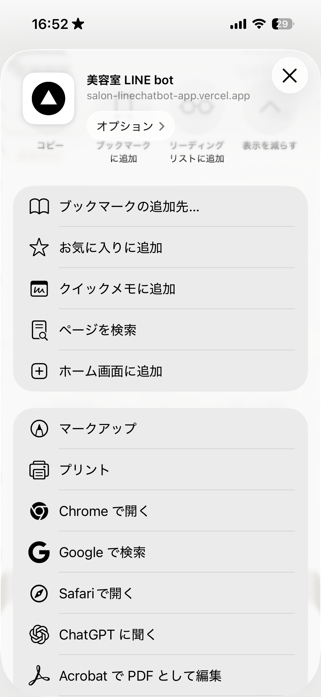

**Android（Chrome）の場合**

1. Chrome で管理画面の URL を開く
2. 画面右上の「︙」（縦3つの点）をタップ
3. 「**ホーム画面に追加**」をタップ
4. 名前を確認して「追加」をタップ

> 📷 スクショ: Android の「ホーム画面に追加」メニュー（項目が見えるように）

### 1.3 ログインする

1. 管理画面を開くと「**管理画面ログイン**」という画面が出ます
2. 「**パスワード**」の欄に、別紙のパスワードを入力します
3. 「**ログイン**」ボタンをタップします
4. うまくいくと「FAQ管理」の画面に切り替わります

> 📷 スクショ: ログイン画面（見出し「管理画面ログイン」とパスワード欄が見えるように）

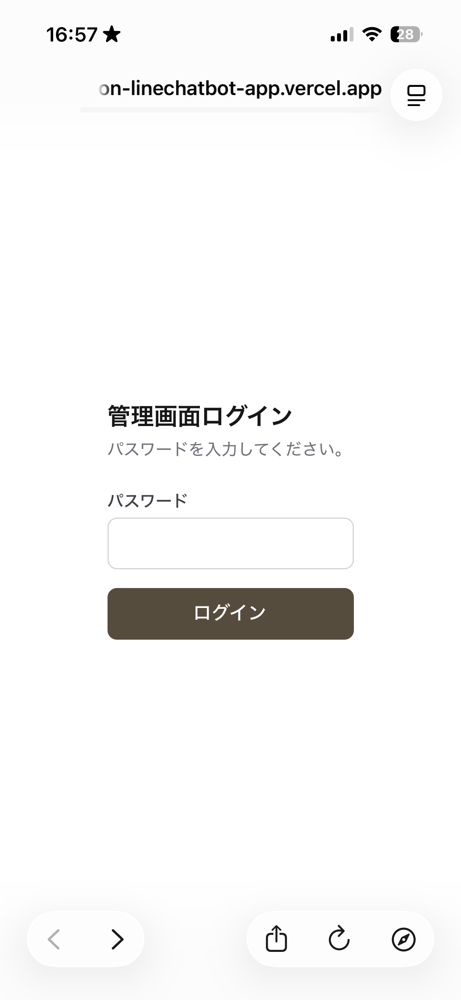

**「パスワードが違います。もう一度お試しください。」と出たとき**

入力ミスか、パスワードが変わっています。別紙のパスワードをもう一度確認してください。
それでも入れないときは構築担当者に連絡してください。

### 1.4 ログインした後の画面の見方

- 画面の上のほうに、切り替え用のボタンが**4つ**並んでいます。
  左から「**FAQ管理**」「**メニュー管理**」「**ログ**」「**配信**」です。
- 右上に「**ログアウト**」ボタンがあります。

| ボタン       | 何をする画面か                       | 説明 |
| ------------ | ------------------------------------ | ---- |
| FAQ管理      | よくある質問と答えの登録・編集       | 2章  |
| メニュー管理 | メニュー名・料金・説明の編集         | 3章  |
| ログ         | お客様とのやりとりの確認（見るだけ） | 4章  |
| 配信         | お知らせの一斉配信                   | 7章  |

> 📷 スクショ: ログイン直後の画面（上部の4つのボタンと、右上「ログアウト」に印）

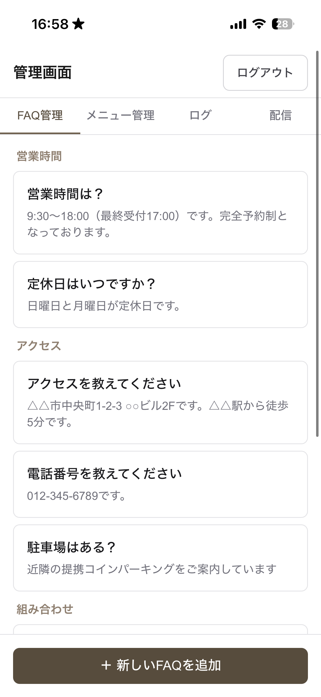

### 1.5 使い終わったら

- **自分専用のスマホ**なら、そのまま閉じて構いません（次回もログインしたままです）。
- **他の人も使うスマホ**なら、右上の「**ログアウト**」を必ずタップしてください。

### 覚えておくこと

- パスワードは**人に教えない・SNS に載せない**。
- 管理画面を開いたまま**他人にスマホを渡さない**。

---

## 2. FAQ管理（よくある質問と答えの登録）

**このセクションでやること:** お客様からよく聞かれる質問と、その答えを登録します。
ここに登録した内容が、**自動返信のいちばんの元ネタ**になります。営業時間・料金・
アクセスなど、聞かれて困らないものを最初にひととおり入れておきましょう。

### 2.1 登録した内容が自動返信にどう使われるか

- お客様が LINE で質問を送ると、システムは**登録されている FAQ 全部**に目を通して、
  いちばん近い「答え」をもとに返信文を作ります。
- **質問文は、お客様の言葉と一字一句同じでなくて大丈夫です。**
  「営業時間は？」と登録しておけば、「何時からやってますか」「今日は開いてる？」
  のような聞き方でも同じ答えを返します（くみ取りはシステムがやります）。
- ただし、**答えに書いていないことは答えられません。**
  「駐車場あり」と返してほしいなら、回答文に「駐車場があります」と書いておく必要が
  あります。
- 仕組みのもう少し詳しい話は「付録B（自動返信の仕組み）」にまとめてあります。
  読まなくても運用はできます。

### 2.2 登録されている FAQ を見る

1. 管理画面にログインすると、最初に開くのが「**FAQ管理**」の画面です。
   （他の画面にいるときは、上の「**FAQ管理**」ボタンをタップ）
2. 登録済みの FAQ が、**カテゴリごとにまとまって**一覧表示されます。
   カテゴリは「営業時間」「料金・メニュー」「アクセス」「組み合わせ」「予約」
   「その他」の6種類です（1件も登録が無いカテゴリは表示されません）。
3. 各行には、上に**質問**、下にグレーで**答えの最初の2行**が出ます。
4. まだ1件も登録していないときは、「まだFAQが登録されていません。」という案内が
   出ます。

> 📷 スクショ: FAQ管理の一覧画面（カテゴリ見出しと、質問＋答えプレビューの行が
> 見えるように。下部の「＋ 新しいFAQを追加」ボタンも入れる）


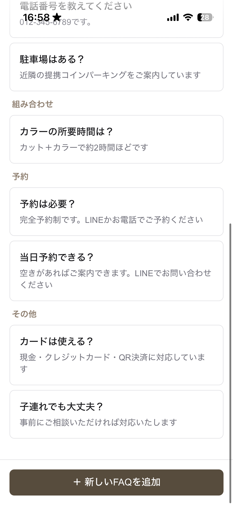

### 2.3 新しい FAQ を追加する

1. 画面いちばん下の「**＋ 新しいFAQを追加**」ボタンをタップします。
   （このボタンは画面を下にスクロールしても、常に下に貼り付いています）
2. 「**FAQを追加**」の画面になります。次の3つを入力します。

   | 欄       | 何を入れるか                                                       |
   | -------- | ------------------------------------------------------------------ |
   | カテゴリ | 一覧のどのグループに入れるか。下向き三角をタップして選びます       |
   | 質問     | お客様が聞いてくる内容（例: 営業時間は何時から何時までですか？）   |
   | 回答     | そのまま返信に使ってほしい答え（例: 営業時間は10:00〜19:00です。） |
   - **カテゴリの選び方**: 欄をタップすると、iPhone は画面下からリストが出てきます。
     Android はその場でリストが開きます。どちらも指で選んで確定します。
     迷ったら「その他」で構いません（後から変えられます）。
   - 「組み合わせ」は、「カットとカラーは一緒にできますか？」のように**複数メニューを
     まとめてやりたい**ときの質問に使います。

3. 入力できたら「**追加する**」ボタンをタップします。
   （保存中は「保存中…」の表示になり、二重に押しても大丈夫です）
4. 一覧に戻り、上に緑色で「**FAQを追加しました。**」と出れば完了です。

> 📷 スクショ: FAQ追加の入力画面（カテゴリ・質問・回答の3欄と「追加する」ボタン）

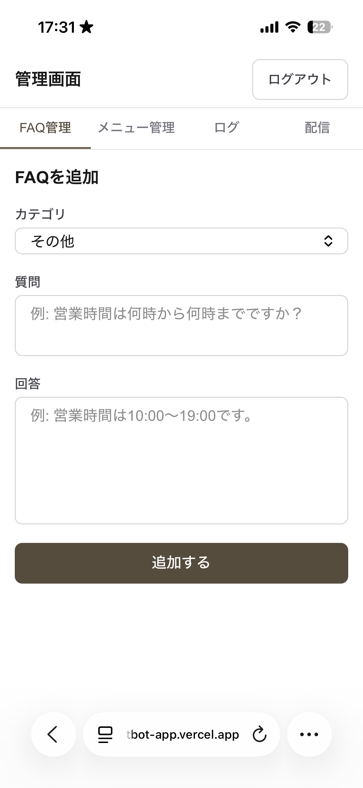

**入力の決まり**

- カテゴリは必ず選びます（初期状態は「その他」なので、通常はそのままでも通ります）。
- 質問は**だいたい200文字まで**、回答は**だいたい2000文字まで**。
- 質問・回答が空だと、赤い字で「質問を入力してください。」などと出て保存できません。
  その場合は足りない欄を埋めて、もう一度「追加する」を押してください
  （入力済みの内容は消えません）。

### 2.4 FAQ を編集する

1. FAQ管理の一覧で、直したい行を**タップ**します。
2. 「**FAQを編集**」の画面になり、今の内容が入った状態で開きます。
3. カテゴリ・質問・回答を直します。
4. 「**更新する**」ボタンをタップします。
5. 一覧に戻り、緑色で「**FAQを更新しました。**」と出れば完了です。

> 📷 スクショ: FAQ編集の画面（内容が入った状態。「更新する」ボタンと、その下の
> 赤い「このFAQを削除する」リンクが見えるように）

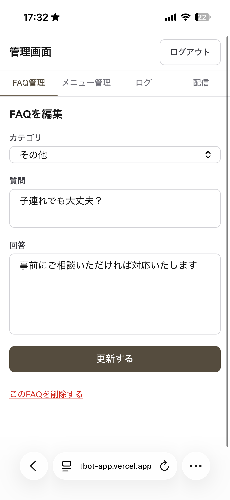

**よくある編集の例**

- 料金を改定した → 「料金・メニュー」の該当 FAQ を開いて金額を直す
  （※ メニュー一覧そのものの金額は「3章 メニュー管理」で直します。FAQ の回答文に
  金額を書いている場合は、**両方**直す必要があります）
- 「アクセス」に道順の説明を足したい → 該当 FAQ の回答文に追記する

### 2.5 FAQ を削除する

削除は**元に戻せません**。押し間違い防止のため、確認画面を1枚はさむ作りにしています。

1. 消したい FAQ を一覧でタップして「**FAQを編集**」画面を開きます。
2. 画面をいちばん下までスクロールし、赤い字の「**このFAQを削除する**」をタップします。
3. 「**このFAQを削除しますか？**」という確認画面が出て、消そうとしている内容が
   表示されます。ここでよく確認してください。
4. 本当に消してよければ、赤い「**削除する**」ボタンをタップします。
   やめる場合は「**キャンセルして編集画面に戻る**」をタップします。
5. 一覧に戻り、緑色で「**FAQを削除しました。**」と出れば完了です。

> 📷 スクショ: 削除の確認画面（見出し「このFAQを削除しますか？」・内容のプレビュー・
> 赤い「削除する」ボタン）

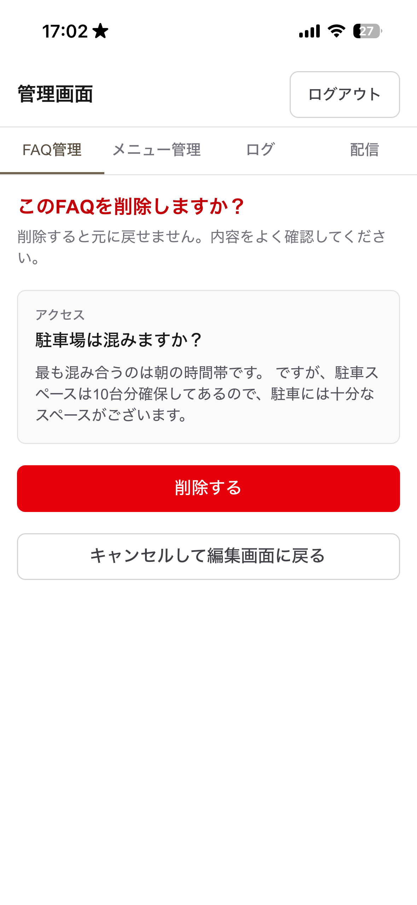

> **迷ったら削除しないで編集で。** 「この質問はもう来ないかも」という程度なら、
> 消さずに残しておいて問題ありません。回答が古くなっただけなら 2.4 の編集で直します。

### 2.6 良い FAQ の書き方のコツ

- **回答は、そのままお客様に送られてもいい文章で書く。**
  ぶっきらぼうな箇条書きより、「〜です」「〜ください」の丁寧な文にします。
- **1つの FAQ に1つの話題。** 「営業時間と定休日」を1件に詰め込むより、分けたほうが
  的確に返せます。
- **数字・固有名詞ははっきり書く。** 「10:00〜19:00」「最終受付18:00」「〇〇駅から
  徒歩5分」など。ぼかすと自動返信もぼやけます。
- **答えられないことは、正直にそう書く。** 例:「当日予約はお電話のみで受け付けて
  います」。無理に何か答えさせようとしないほうが、変な返信を防げます。
- **最初に入れておくと安心な5件**: 営業時間 / 定休日 / 主なメニューと料金 / 場所・
  行き方 / 予約方法。

### よくあるつまずき

| 症状                                   | 対処                                                                                     |
| -------------------------------------- | ---------------------------------------------------------------------------------------- |
| 「保存に失敗しました。」と赤く出る     | 通信の一時的な不調のことが多いです。少し待ってもう一度「追加する／更新する」を押す       |
| 追加したのに一覧に出てこない           | そのカテゴリの見出しごと下に隠れていないかスクロールして確認。それでも無ければ再ログイン |
| 赤い字のエラーが消えず保存できない     | 空欄か文字数オーバー。エラー文の指す欄（質問／回答）を直す                               |
| 間違えて削除した                       | 元に戻せません。同じ内容をもう一度 2.3 で登録し直す                                      |
| 何度やっても保存できない・画面が真っ白 | 「8章 困ったときは」を見て、直らなければ構築担当者に連絡                                 |

### 覚えておくこと

- ここに登録した**回答文がそのまま自動返信の元**になる。誤字や古い料金に注意。
- 削除は元に戻せない。基本は**編集で直す**。
- FAQ をたくさん入れるほど自動返信は賢くなる。気づいたら少しずつ足していく。

---

## 3. メニュー管理（メニュー名・料金・説明の編集）

**このセクションでやること:** お店のメニューと料金を登録します。ここに登録した内容は、
お客様が「カットいくら？」「どんなメニューがありますか？」などと聞いたときの
**自動返信の元**になります。2章の FAQ と並ぶ、もう1つの大事な情報源です。

### 3.1 登録したメニューが自動返信にどう使われるか

- お客様が料金やメニューについて質問すると、システムは**「お客様向けに表示する」に
  なっているメニューの一覧（名前・料金・説明）**を見て、返信文を作ります。
- お客様には、この画面で**上から並べた順**でメニューが伝わります。
- **「お客様向けに表示する」のチェックを外したメニューは、自動返信にも出てきません。**
  期間限定メニューを一時的に隠したいときなどに使います（→ 3.7）。
- 施術にかかる時間（所要時間）を伝えたいときは、「**説明**」欄に「約90分」などと
  書いておきます。時間専用の入力欄はありません。

### 3.2 登録されているメニューを見る

1. 画面上の「**メニュー管理**」ボタンをタップします。
2. 登録済みのメニューが**上から順に**一覧表示されます（FAQ のようなカテゴリ分けは
   ありません）。
3. 各行には、**メニュー名**・**料金**（例: 5,000円）・**説明**（登録していれば最初の2行）が
   出ます。「お客様向けに表示する」のチェックを外しているメニューには、グレーで
   「**非表示**」と付きます。
4. まだ1件も登録していないときは、「まだメニューが登録されていません。」という案内が
   出ます。

> 📷 スクショ: メニュー管理の一覧画面（メニュー名・料金の行が数件。うち1件に「非表示」
> バッジ。行の右側の↑↓ボタンと、下部の「＋ 新しいメニューを追加」ボタンも入れる）

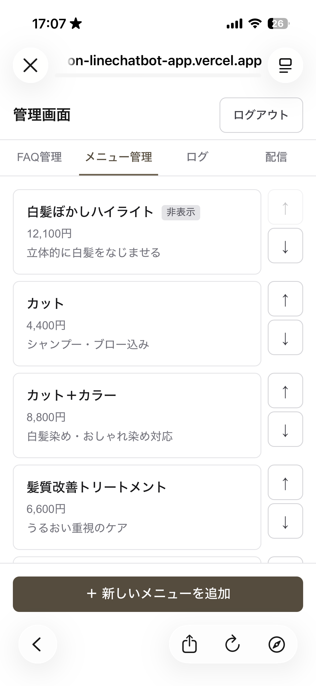

### 3.3 新しいメニューを追加する

1. 画面いちばん下の「**＋ 新しいメニューを追加**」ボタンをタップします
   （下にスクロールしても、常に下に貼り付いています）。
2. 「**メニューを追加**」の画面になります。次を入力します。

   | 欄                   | 何を入れるか                                                          |
   | -------------------- | --------------------------------------------------------------------- |
   | メニュー名           | 例: カット＋カラー                                                    |
   | 価格（円）           | 数字だけ。例: 5000（「¥」や「円」は付けません）                       |
   | 説明（任意）         | 補足があれば。例: 髪質に合わせたカラーとカットのセットです。約120分。 |
   | お客様向けに表示する | チェックを入れると自動返信・一覧に出ます。ふだんはチェックのままで OK |
   - 価格の欄をタップすると、スマホでは**数字のキーパッド**が出ます。全角の「５０００」や
     カンマ入りの「5,000」で入れても、保存するときに自動で直されます。

3. 「**追加する**」ボタンをタップします
   （保存中は「保存中…」の表示になり、二重に押しても大丈夫です）。
4. 一覧に戻り、上に緑色で「**メニューを追加しました。**」と出れば完了です。
   **新しく追加したメニューは、一覧のいちばん下に入ります。** 位置は 3.6 で動かせます。

> 📷 スクショ: メニュー追加の入力画面（メニュー名・価格・説明・「お客様向けに表示する」
> チェックと「追加する」ボタン）

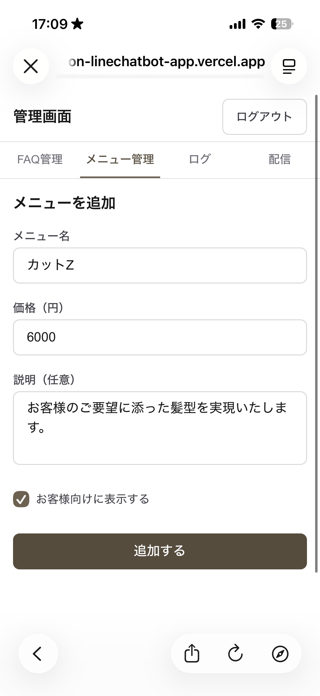

**入力の決まり**

| 欄         | 決まり                                              | 外れると出る赤い字                                                                  |
| ---------- | --------------------------------------------------- | ----------------------------------------------------------------------------------- |
| メニュー名 | 必須・100文字まで                                   | 「メニュー名を入力してください。」／「メニュー名は100文字以内で入力してください。」 |
| 価格       | 必須・0以上の整数のみ（小数・マイナス・文字は不可） | 「価格を入力してください。」／「価格は0以上の整数で入力してください。」             |
| 説明       | 任意・500文字まで                                   | 「説明は500文字以内で入力してください。」                                           |

赤い字が出たら、その欄を直してもう一度「追加する」を押します（入力済みの内容は消えません）。

### 3.4 メニューを編集する

1. 一覧で、直したいメニューの行を**タップ**します。
2. 「**メニューを編集**」の画面が、今の内容が入った状態で開きます。
3. メニュー名・価格・説明・表示のチェックを直します。
4. 「**更新する**」ボタンをタップします。
5. 一覧に戻り、緑色で「**メニューを更新しました。**」と出れば完了です。

> 📷 スクショ: メニュー編集の画面（内容が入った状態。「更新する」ボタンと、その下の
> 赤い「このメニューを削除する」リンクが見えるように）

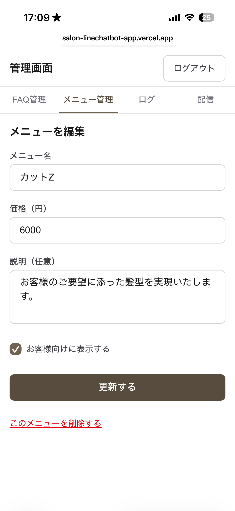

### 3.5 メニューを削除する

削除は**元に戻せません**。押し間違い防止のため、確認画面を1枚はさむ作りにしています。

1. 消したいメニューを一覧でタップして「**メニューを編集**」画面を開きます。
2. 画面をいちばん下までスクロールし、赤い字の「**このメニューを削除する**」をタップします。
3. 「**このメニューを削除しますか？**」という確認画面が出て、消そうとしているメニュー名・
   料金・説明が表示されます。ここでよく確認してください。
4. 本当に消してよければ、赤い「**削除する**」ボタンをタップします。
   やめる場合は「**キャンセルして編集画面に戻る**」をタップします。
5. 一覧に戻り、緑色で「**メニューを削除しました。**」と出れば完了です。

> 📷 スクショ: メニュー削除の確認画面（見出し「このメニューを削除しますか？」・メニュー名と
> 料金・赤い「削除する」ボタン）

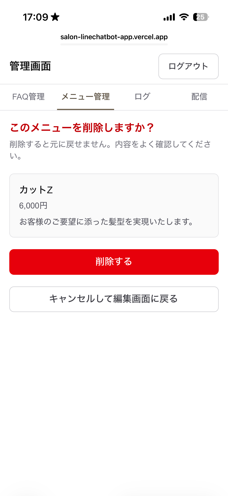

> **メニューをやめただけなら、削除より「非表示」がおすすめです（→ 3.7）。**
> また扱うかもしれないメニューは、消さずに隠しておけば、復活させるときにチェックを
> 入れ直すだけで済みます。

### 3.6 メニューの並び順を変える

自動返信でも一覧でも、ここで並べた順にメニューが出ます。よく聞かれるメニューを
上のほうに置いておくと分かりやすくなります。

1. 一覧の各行の**右側にある「↑」「↓」ボタン**をタップします。
2. 「↑」で1つ上へ、「↓」で1つ下へ、隣のメニューと入れ替わります。
3. いちばん上の行の「↑」と、いちばん下の行の「↓」は、うすい表示になっていて押しても
   動きません（それ以上動かせないため）。
4. 並べ替えても緑のメッセージは出ません。一覧の並びが変わっていれば成功です。
   「**並び替えに失敗しました。**」と赤く出たときは、少し待ってもう一度押してください。

> 📷 スクショ: 一覧画面で行の右側の↑↓ボタンを拡大（先頭行の↑がうすくなっているのが
> 分かるように）

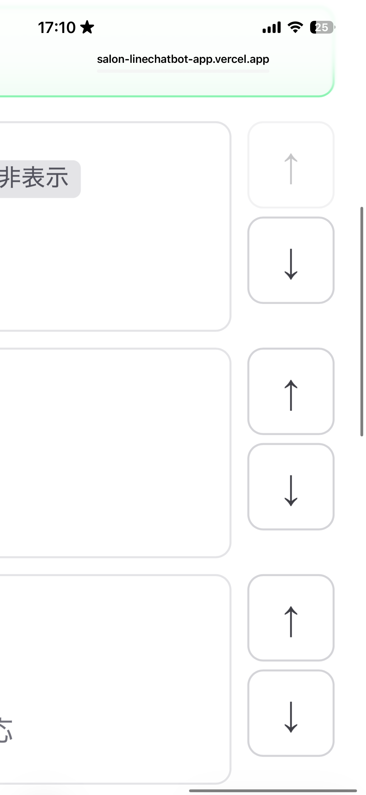

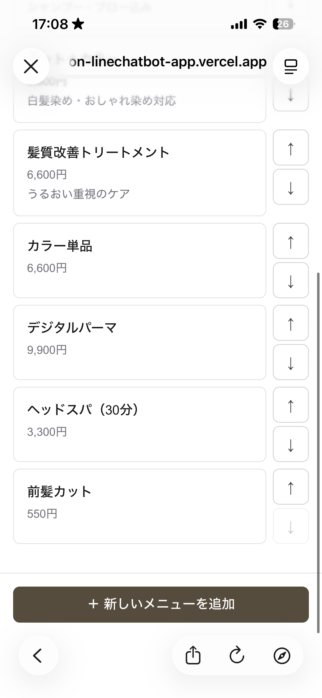

### 3.7 メニューを一時的に隠す（表示／非表示）

期間限定メニューや、今は受けていないメニューを、消さずに隠しておけます。

- **隠す**: そのメニューの「**メニューを編集**」画面を開き、「**お客様向けに表示する**」の
  **チェックを外して**「更新する」。一覧に「非表示」と付き、自動返信にも出なくなります。
- **戻す**: 同じ場所で**チェックを入れて**「更新する」。すぐ元どおり表示されます。

### 3.8 料金を改定したときの注意

料金を変えるときは、**2か所**を直す必要がある場合があります。

1. **メニュー管理**（この章）… メニューそのものの料金。
2. **FAQ管理**（2章）… 「カットはいくらですか？」のような FAQ の**回答文に金額を
   書いている**場合、そちらも直さないと古い金額で返信されてしまいます。

片方だけ直すと、自動返信の中で金額が食い違うことがあります。料金改定のときは、
両方をチェックしてください。

### よくあるつまずき

| 症状                               | 対処                                                                         |
| ---------------------------------- | ---------------------------------------------------------------------------- |
| 「保存に失敗しました。」と赤く出る | 通信の一時的な不調が多いです。少し待ってもう一度「追加する／更新する」を押す |
| 価格が保存できない                 | 数字だけになっているか確認（「5000円」「￥5000」は不可。「5000」と入れる）   |
| 追加したメニューが見つからない     | 一覧のいちばん下に入っています。下までスクロール。並びは 3.6 で変えられます  |
| 自動返信にメニューが出てこない     | 「お客様向けに表示する」のチェックが外れて「非表示」になっていないか確認     |
| 間違えて削除した                   | 元に戻せません。3.3 でもう一度登録し直す（並び順は 3.6 で調整）              |

### 覚えておくこと

- 表示中のメニュー（名前・料金・説明）が、そのまま自動返信の元になる。
- 「非表示」にしたメニューは自動返信に出ない。メニューをやめるときは、削除より非表示が安全。
- 料金改定は「メニュー管理」と「FAQ の回答文」の**両方**を確認する。
- 削除は元に戻せない。

---

## 4. ログ（お客様とのやりとりを見る）

**このセクションでやること:** 自動返信がこれまでにどんな質問を受けて、どう答えたかを
一覧で確認します。ここは**見るだけ**の画面です。追加・編集・削除はできません
（する必要もありません）。

### 4.1 ログ画面を開く

1. 画面上の「**ログ**」ボタンをタップします。
2. 新しいものから順に、**最大50件**のやりとりが表示されます。
3. 画面の先頭に「**直近◯件を新しい順に表示しています。**」と出ます。
4. まだやりとりが無いときは「**まだ会話ログがありません。**」と出ます。

> 📷 スクショ: ログの一覧画面（やりとりのカードが数件。1件は「要対応」バッジ付き。
> 日時・お客様の質問・自動返信・確信度が見えるように。**お客様の記号は必ずぼかす**）

### 4.2 1件ごとの見方

1件のカードには、次のものが並びます。

| 表示             | 意味                                                                                    |
| ---------------- | --------------------------------------------------------------------------------------- |
| 日時             | お客様が送ってきた日時（日本時間）                                                      |
| 「要対応」（赤） | 自動でうまく答えられなかった印。オーナーの対応が必要（→ 5章）。付いていなければ対応不要 |
| お客様の質問     | 実際に送られてきた文（濃い字）                                                          |
| 自動返信         | システムがお客様に返した文（グレーの字）                                                |
| お客様の記号     | LINE のお客様を表す記号。**お名前は出ません**（システムはお客様の本名を持っていません） |
| 確信度           | 自動返信が「どのくらい自信をもって答えられたか」の目安（0〜100%）                       |

**「お客様の記号」について**

- 英数字のならんだ記号で、LINE のお客様1人ずつに割り当てられています。
- **同じ記号なら同じお客様**です。「この人、前にも似た質問をしているな」を見分けるのに
  使えます。
- ここからお客様に直接連絡することはできません（LINE 公式アカウントのトーク画面から
  返信します。→ 5章）。

**「確信度」について**

- 100% に近いほど「はっきり答えられた」、低いほど「自信がない・情報が足りなかった」
  という意味です。
- システムの**自己申告**なので、厳密な数値ではありません。目安として見てください。
- **40% くらいより低いのに返信している**やりとりは、答えが不正確かもしれないサインです。
  そういう質問は、FAQ を足す・直すと改善できます（→ 6章）。

### 4.3 この画面で普段やること

- **ときどき開いて、「要対応」が付いた質問がないか見る**（→ 5章で対応）。
- **確信度が低いやりとり**を見つけたら、FAQ を足すか直す（→ 6章）。
- 「最近このお店の場所を聞かれることが多いな」など**質問の傾向**に気づいたら、
  その内容を FAQ に追加しておく（→ 2章）。

### 4.4 表示の範囲と、できないこと

- 表示は**最新50件まで**です。51件目より前の古いやりとりは、この画面では見られません。
- **検索や絞り込みはできません。**「要対応」だけを抜き出す機能もありません
  （赤いバッジを目印に自分で探します）。
- 読み込みに失敗して「**会話ログの読み込みに失敗しました。**」と赤く出たときは、
  少し待ってから画面を下に引っぱって更新するか、「ログ」ボタンをもう一度タップします。

### 覚えておくこと

- この画面には**お客様が送ってきた文がそのまま出ます**。人に見せる・SNS に載せる・
  スクショを共有する、はしないこと。
- ここは**見るだけ**。やりとりを消したり直したりはできません。自動返信の内容を直すのは
  2章（FAQ）・3章（メニュー）です。
- 「要対応」が付いたやりとりへの対応は、次の5章で説明します。

---

## 5. 「要対応」が来たときの対応

**このセクションでやること:** 自動返信でうまく答えられなかった問い合わせに、
オーナー自身がお客様へ返事をします。

### 5.1 どういうときに「要対応」になるか

システムは、次のようなときに「答えを保留」して、そのやりとりに「**要対応**」の印を付けます。

- FAQ・メニューに載っていないことを聞かれた（例: 「駐車場ありますか？」が未登録）
- 質問があいまいで、システムが内容を読み取れなかった
- **予約の確定や日時の約束**を求められた（システムは予約を確定しません）
- クレーム、込み入った相談

このときお客様には「**確認してご連絡いたします**」といった内容が自動で返信されます。
つまりお客様は**あなたからの折り返しを待っている状態**です。

### 5.2 通知が LINE に届く

- 「要対応」になると、**オーナーの LINE に通知メッセージが届きます。**
  お店の LINE 公式アカウントから、あなた個人のトークに送られてきます。
- 通知の中身はこんな形です（文面は多少変わることがあります）。

  ```
  【要対応】自動回答できないお問い合わせがありました

  お客様からの質問:
  「（お客様が送ってきた文。長い場合は先頭200字）」

  確信度: 30%

  内容をご確認のうえ、必要であればお客様にご連絡ください。
  詳細は管理画面の会話ログ（/admin/conversations）でご確認いただけます。
  ```

- 「詳細はこちら」の部分に**タップできる URL**が入っていることもあります。
  その場合はタップするとログ画面（4章）が開きます。
- **通知が届かない設定になっていることもあります**（構築担当者が通知先を設定して
  いない場合）。そのときは、ときどき自分でログ画面（4章）を開いて、赤い「要対応」
  バッジを探してください。

> 📷 スクショ: 実際に届いた「要対応」通知（LINE のトーク画面）

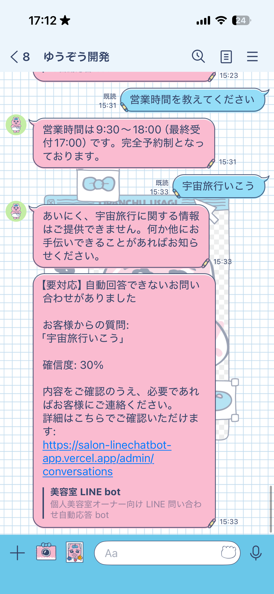

### 5.3 お客様に返事をする

通知、またはログ画面（4章）で「要対応」の質問を確認したら、お客様へ直接返信します。

1. **お店の LINE 公式アカウントを管理するアプリ**（「LINE公式アカウント」アプリ）を
   開きます。
2. 「**チャット**」を開きます。お客様から届いたメッセージの一覧が出ます。
3. 「要対応」になった質問を送ってきたお客様を探します。
   - ログ画面や通知には**お客様のお名前が出ません**。**質問の文面と届いた時刻**で
     見当をつけます。
   - チャット一覧の中から、同じ文面のメッセージを探すと見つけやすいです。
4. そのお客様のトークを開いて、**手で返信を入力して送ります。**
5. 送ったら対応は完了です。
   - システム側で「対応済み」にする操作はありません。ログ画面の「要対応」バッジは
     表示されたまま残ります（気にしなくて大丈夫です）。

> 📷 スクショ: 「LINE公式アカウント」アプリの「チャット」画面（該当のお客様を選ぶところ）

> 「チャット」が見当たらない、返信の入力欄が出ないときは、公式アカウント側の設定が
> 必要かもしれません。構築担当者に連絡してください（→ 0章の連絡先）。

### 5.4 気をつけること

- お客様には自動返信で既に「確認してご連絡します」と伝わっています。**放置すると
  「連絡が来ない」と思われます。**気づいたらなるべく早めに返信してください。
- 予約の希望だった場合は、空き状況を確認して日時を返します。
- **確信度が高め（60〜80%）でも「要対応」が付くこと**があります（予約希望・クレーム
  など、情報はあっても人が対応すべきケース）。数字より中身を見て判断します。
- 同じ質問が何度も「要対応」になるなら、**その内容を FAQ に追加**しておくと、次からは
  自動で答えられるようになります（→ 2章・6章）。

### 覚えておくこと

- 「要対応」＝システムが答えを保留し、お客様に「後で連絡します」と伝えた状態。
  **続きはオーナーがやる。**
- 返信は**「LINE公式アカウント」アプリの「チャット」**から手で送る。
- お客様のお名前はシステムに無い。**質問文と時刻**で本人を照合する。
- 同じ質問が繰り返し来るなら、FAQ に入れて「要対応」自体を減らす。

---

## 6. 自動返信がおかしいときに直す

**このセクションでやること:** 自動返信の内容が「古い」「ずれている」「答えられていない」
とき、オーナー自身で直します。直す場所は基本的に **2章（FAQ）と 3章（メニュー）だけ**です。

### 6.1 「おかしい」と気づくきっかけ

- ログ画面（4章）を見て、**確信度が低い**やりとりや、変な返信を見つけた
- お客様から「LINE の返事が実際と違った」と言われた
- 自分でテストして確かめてみた（→ 6.2）

### 6.2 まず自分で試してみる

1. **自分の LINE**（お店の公式アカウントを友だち追加したもの）から、お店の公式アカウントに
   質問を送ります。
2. どんな返信が来るかを確認します。
   - 自分の LINE から送ると、「要対応」になったときは 5章の通知も自分に届くので、
     動きが分かりやすいです。
3. 家族や友人に頼んで、いろいろな聞き方（「何時まで？」「今日やってる？」など）で
   送ってもらうと、弱いところが見つけやすくなります。

### 6.3 症状べつの直し方

| 症状                                                     | 直し方                                                                                                                                     |
| -------------------------------------------------------- | ------------------------------------------------------------------------------------------------------------------------------------------ |
| 料金・営業時間など**古い情報**を答える                   | その内容の FAQ の回答文を直す（2.4）。料金ならメニュー側も直す（3.8）                                                                      |
| 「確認します」「分かりません」**ばかり**返す             | その質問の FAQ がまだ無い。2.3 で質問と答えを追加する                                                                                      |
| 答えが**一部だけ**／少しずれている                       | その FAQ の質問文・回答文を、お客様の実際の聞き方に近づけて、具体的に書き直す（2.4・2.6）                                                  |
| 2つ聞いたのに**1つしか**答えない                         | 1件の FAQ に話題を詰め込みすぎ。話題ごとに FAQ を分ける（2.6）                                                                             |
| メニューに無い料金を**勝手に**答える                     | あいまいな記述が原因のことが多い。関係する FAQ の回答文やメニューの説明欄から、あいまいな部分を消す                                        |
| 「カットとカラー一緒だと？」のような**組み合わせ**に弱い | カテゴリ「組み合わせ」で FAQ を追加する（例: 質問「カットとカラーは一緒にできますか？」／回答「はい、カット＋カラーで◯◯円・約◯分です。」） |

### 6.4 直したら、もう一度試す

- 変更は**保存した瞬間から**次の質問に反映されます（時間差はありません）。
- 直したら必ず、**さっきと同じ質問をもう一度送って**、直っているか確認してください。

### 6.5 それでも直らないとき

- FAQ を何度足しても変な返信になる／返信が来ない／エラーが出る → 8章を確認し、
  それでもだめなら構築担当者に連絡（→ 0章の連絡先）。
- 「返信の言葉づかい・トーンを全体的に変えたい」は、この管理画面では変えられません。
  構築担当者に相談してください。

### 覚えておくこと

- 直す場所は基本 **2章（FAQ）と 3章（メニュー）だけ**。
- **「載っていないことは答えられない」。**足りない情報は FAQ に書き足す。
- 直したら必ず**自分でテスト送信**して確認する。
- 反映は**すぐ**（保存した瞬間から効く）。

---

## 7. お知らせの一斉配信

**このセクションでやること:** 友だち登録しているお客様**全員**に、同じお知らせを一度に
送ります。臨時休業・年末年始の営業案内・キャンペーンのお知らせなどに使います。

> ⚠️ 一斉配信は**取り消せません**。送る前に、必ず「テスト送信」で自分の LINE に届く
> 内容を確認してください。

### 7.1 配信の前に知っておくこと

- 送り先は**友だち全員**です。「常連さんだけ」「予約がある人だけ」のように**相手を
  選ぶことはできません。**
- **送ったあとの取り消し・修正はできません。**日付の間違いなども直せません。
- LINE には**1か月に無料で送れる数の上限**があります（おおよそ「友だちの人数 ×
  配信した回数」で消費されます）。上限を超えると配信が失敗します。**頻繁に送りすぎ
  ない**こと。
- 回数が多い・内容が長いと、お客様にブロックされる原因になります。お知らせは
  簡潔に、必要なときだけ。

### 7.2 お知らせを書く

1. 画面上の「**配信**」ボタンをタップします。
2. 「**お知らせ本文**」に文章を入力します。
   （例: 9/15（月）は臨時休業とさせていただきます。ご迷惑をおかけしますが、
   よろしくお願いいたします。）
3. 「**プレビューを確認**」ボタンをタップします。
   - 空のままだと「**配信する文面を入力してください。**」と赤く出ます。
   - 5000文字を超えると「文面は5000文字以内で入力してください。」と出ます
     （お知らせでそこまで長くなることはまずありません）。

> 📷 スクショ: お知らせ本文の入力画面（「プレビューを確認」ボタンが見えるように）

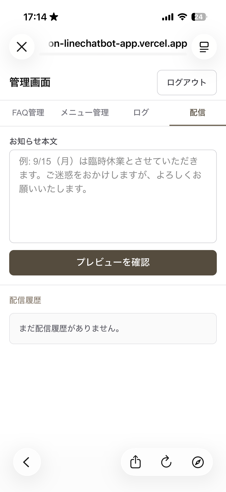

### 7.3 プレビューで確認する

「プレビューを確認」を押すと、確認画面に切り替わります。

- **プレビュー**の枠に、実際に送られる文がそのまま表示されます。
  **誤字・日付・曜日**をここでよく確認してください。
- 赤い注意書き「**配信すると取り消せません。内容をよく確認してください。**」が出ます。
- 文章を直したいときは「**編集に戻る**」をタップします（入力した文は消えません）。

> 📷 スクショ: 確認画面（プレビューの枠・赤い注意書き・「テスト送信」「配信する」ボタン）

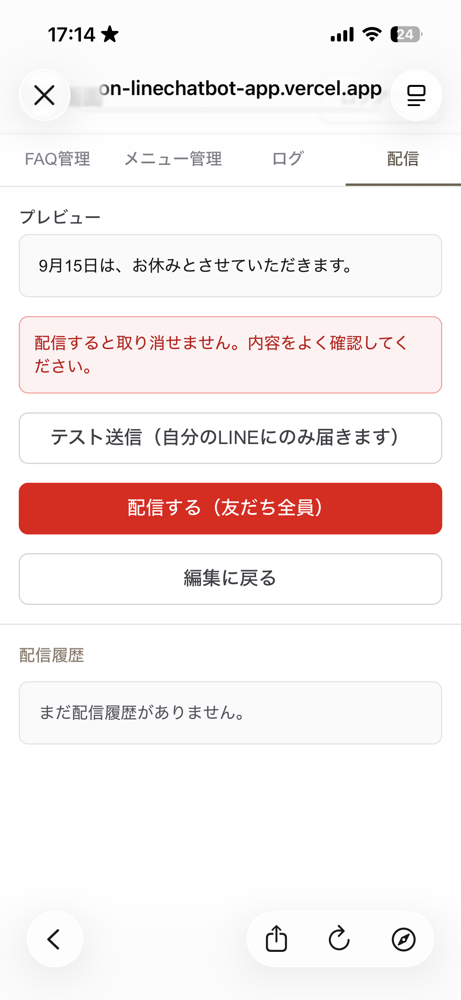

### 7.4 まずテスト送信（自分の LINE で確認）

確認画面に「**テスト送信（自分の LINE にのみ届きます）**」ボタンがあれば、本番の前に
必ずこれを使います。

1. 「**テスト送信**」をタップします。
2. 「**テスト送信しました。自分の LINE を確認してください。**」と緑色で出ます。
3. 自分の LINE にお知らせが届きます。**お客様に届くのとまったく同じ見た目**なので、
   ここで日付・曜日・誤字を最終確認します。

- ボタンが無く「LINE_TEST_USER_ID が未設定のため…」と表示されている場合、テスト送信は
  使えません。構築担当者に設定を頼むか、プレビューの文面を念入りに確認してから
  次に進んでください。
- 「テスト送信に失敗しました。」と出たら、少し待ってもう一度試します。

### 7.5 本番配信する（友だち全員）

テスト送信の内容に問題がなければ、赤い「**配信する（友だち全員）**」ボタンをタップします。

- 配信中は「**配信中…**」の表示になります。
- 成功すると一覧に戻り、緑色で「**配信しました。**」と出ます。
- 「**配信に失敗しました。**」と赤く出たときは、**送信できていません**。少し時間を
  おいて、もう一度「配信する」を押します。それでも失敗するときは 7.7 と 8章を見て
  ください。

> 📷 スクショ: 配信完了後の「配信しました。」表示

### 7.6 配信の履歴を見る

配信フォームの下に、これまでの配信履歴が新しい順に並びます（**最大50件・見るだけ**）。

- 緑の「**成功**」／赤の「**失敗**」バッジ
- 送った本文（先頭の数行）
- 失敗した場合は、その**理由**（多くは英語）も表示されます

### 7.7 配信が失敗するとき

| 状況                                     | 対処                                                        |
| ---------------------------------------- | ----------------------------------------------------------- |
| その月の無料送信数の上限を超えた         | 翌月まで待つか、LINE の有料プランを検討（構築担当者に相談） |
| 一時的な通信エラー                       | 少し待ってから、もう一度「配信する」を押す                  |
| 履歴に赤い「失敗」＋英語の理由が出ている | その理由の文言をそのまま構築担当者に伝える                  |

### 覚えておくこと

- 一斉配信は**取り消せない・相手を選べない**。送る前に必ず**テスト送信**で確認する。
- 日付・曜日・誤字は、プレビューとテスト送信で**指差し確認**。
- **送りすぎない**（月の上限と、ブロック対策）。
- 失敗したら配信履歴の理由を見る。分からなければ構築担当者へ。

---

## 8. 困ったときは

**このセクションでやること:** 管理画面や自動返信の**調子がおかしいとき**の対処です。
「返信の中身が違う・古い」は 6章、ここでは「開けない・保存できない・止まった」など
仕組みそのものの不調を扱います。

### 8.1 まず試す3つ

1. **画面を下に引っぱって更新する**（再読み込み）。
2. **アプリ（ホーム画面のアイコン）を一度閉じて、開き直す。**
3. **通信を確認する。** Wi-Fi／モバイル通信がつながっているか、他のサイトが開けるか。

たいていの一時的な不調は、これで直ります。

### 8.2 症状べつの対処

| 症状                                                         | 対処                                                                                                                                         |
| ------------------------------------------------------------ | -------------------------------------------------------------------------------------------------------------------------------------------- |
| ログインできない／「パスワードが違います。」                 | 別紙のパスワードをもう一度確認（英字の大文字小文字・記号に注意）。それでも入れないなら構築担当者へ（パスワードが変わった可能性）             |
| ログインしても、すぐログイン画面に戻ってしまう               | スマホの日付・時刻が大きくずれていないか確認し「自動設定」にする。プライベートブラウズをやめる。直らなければ構築担当者へ                     |
| 画面が真っ白／「問題が発生しました」のような表示             | 8.1 の3つを試す。何度も続くなら構築担当者へ（画面に出た文言を控えておく）                                                                    |
| 「保存に失敗しました」「読み込みに失敗しました」が何度も出る | 通信を確認し、少し時間をおく。10分以上続くなら構築担当者へ                                                                                   |
| FAQ／メニューを直したのに自動返信に反映されない              | 本当に「更新する」を押して緑のメッセージが出たか確認。メニューが「非表示」になっていないか。似た内容の別の FAQ が優先されていないか（→ 6章） |
| **自動返信がまったく来なくなった**（全部反応しない）         | **すぐ構築担当者へ連絡。** LINE 側の設定や接続の問題で、管理画面からは直せません                                                             |
| 「要対応」の通知が来ない                                     | もともと届かない設定のことがあります（→ 5.2）。当面はログ画面（4章）で確認する運用に。通知を有効にしたいなら構築担当者へ                     |
| 一斉配信が失敗する                                           | → 7.7 を参照                                                                                                                                 |
| お客様から「変な返信が来た」と言われた                       | → 6章（内容の直し方）                                                                                                                        |

### 8.3 構築担当者に連絡するとき、伝えること

伝える内容がそろっていると、解決が早くなります。

- **いつ**（日付・だいたいの時刻）
- **どの画面で、何をしたら**そうなったか
- **画面に出たメッセージ**（できればスクリーンショット）
- お客様から言われた場合は、**その内容**（お客様の質問文・届いた時刻）
- **自分で試したこと**（更新した／開き直した／通信を確認した、など）

### 8.4 やってはいけないこと

- パスワードを人に教える／SNS に載せる。
- 構築担当者に相談せずに、LINE やサーバーの設定を触る。
- 同じ操作を何十回も連打する（時間をおいてから試す）。

### 覚えておくこと

- まずは**「更新・開き直し・通信確認」**。
- **「自動返信が全部止まった」「ログインできない」**は自分で抱え込まず、すぐ構築担当者へ。
- 連絡するときは**「日時・操作・画面の文言」**をセットで伝える。

---

## 9. 日々の運用（習慣にすること）

**このセクションでやること:** 何を・どのくらいの頻度でやればいいか、の早見表です。
細かい手順は各章にあります。

### 9.1 できれば毎日

- **「要対応」の通知が来ていないか**を見る。来ていたら 5章の対応をする。

### 9.2 週に1回

- **ログ画面（4章）をざっと見る。**「確信度が低いのに答えている」「答えられていない」
  やりとりがないか確認し、あれば 6章の要領で FAQ を足す・直す。

### 9.3 お店の情報が変わったとき（その都度）

| 変わったこと               | やること                                                                 |
| -------------------------- | ------------------------------------------------------------------------ |
| 営業時間・定休日を変えた   | FAQ「営業時間」を修正（2.4）                                             |
| 料金を変えた               | メニュー管理で料金を修正（3章）＋ 金額を書いた FAQ の回答文も修正（3.8） |
| メニューを増やした／やめた | メニュー管理で追加（3.3）／「非表示」にする（3.7）                       |
| 移転・電話番号の変更       | 「アクセス」「その他」の FAQ を修正（2.4）                               |
| 臨時休業・特別営業         | 一斉配信でお知らせ（7章）。必要なら期間中だけ FAQ に一時的な案内を足す   |

### 9.4 月に1回

- **FAQ を一度ぜんぶ読み返す。** 古くなっている回答がないか点検する。
- 配信履歴（7.6）を見て、**お知らせを送りすぎていないか**確認する。

### 9.5 ずっと変わらないもの（さわらない）

- パスワード、各種サービスの設定、「自動返信を一時的に止める」などの操作は、
  **構築担当者の担当**です（→ 0章）。必要になったら連絡してください。

### 覚えておくこと

- **「要対応」は早めに。ログは週1で流し見。**
- お店の情報が変わったら、**その日のうちに**FAQ／メニューも直す。
- 困ったら 0章の連絡先。

---

## 付録A. スクリーンショット撮影リスト

このマニュアルに差し込む画面写真の一覧です。本文中の `📷` の位置に対応します。
すべて**スマホで管理画面を開いて**撮影します（個人情報が写り込まないよう、ログの
お客様の記号や実際の質問文はぼかすか、テスト用データで撮ってください）。

画像ファイルは `docs/images/` に置き、本文からは `images/ファイル名` で参照します。
「未撮影（マーカーのまま）」の4点（No.2 / No.14 / No.16 / No.19）は、本文では `📷` マーカーのまま残しています。
No.14（ログの一覧）は、お客様の LINE の記号が写らないよう加工してから差し込みます。

| No. | 章  | 撮る画面                                                                                                                                  | 画像ファイル                              |
| --- | --- | ----------------------------------------------------------------------------------------------------------------------------------------- | ----------------------------------------- |
| 1   | 1.2 | iPhone（Safari）の「ホーム画面に追加」メニュー（項目が見えるように）                                                                      | `IMG_6243.PNG`                            |
| 2   | 1.2 | Android（Chrome）の「ホーム画面に追加」メニュー（項目が見えるように）                                                                     | 未撮影（マーカーのまま）                  |
| 3   | 1.3 | ログイン画面（見出し「管理画面ログイン」とパスワード欄）                                                                                  | `IMG_6244.PNG`                            |
| 4   | 1.4 | ログイン直後の画面（上部の4つのボタンと、右上「ログアウト」に印）                                                                         | `IMG_6245.PNG`（No.5と共用）              |
| 5   | 2.2 | FAQ管理の一覧画面（カテゴリ見出しと、質問＋答えプレビューの行。下部の「＋ 新しいFAQを追加」ボタンも）                                     | `IMG_6245.PNG` ＋ `IMG_6247.PNG`（下部）  |
| 6   | 2.3 | FAQ追加の入力画面（カテゴリ・質問・回答の3欄と「追加する」ボタン）                                                                        | `IMG_6269.PNG`                            |
| 7   | 2.4 | FAQ編集の画面（内容が入った状態。「更新する」ボタンと赤い「このFAQを削除する」リンク）                                                    | `IMG_6271.PNG`                            |
| 8   | 2.5 | FAQ削除の確認画面（見出し「このFAQを削除しますか？」・内容プレビュー・赤い「削除する」ボタン）                                            | `IMG_6251.PNG`                            |
| 9   | 3.2 | メニュー管理の一覧画面（メニュー名・料金の行。1件に「非表示」バッジ。右側の↑↓ボタンと下部の「＋ 新しいメニューを追加」ボタン）            | `IMG_6255.PNG`                            |
| 10  | 3.3 | メニュー追加の入力画面（メニュー名・価格・説明・「お客様向けに表示する」チェックと「追加する」ボタン）                                    | `IMG_6257.PNG`                            |
| 11  | 3.4 | メニュー編集の画面（内容が入った状態。「更新する」ボタンと赤い「このメニューを削除する」リンク）                                          | `IMG_6258.PNG`                            |
| 12  | 3.5 | メニュー削除の確認画面（見出し「このメニューを削除しますか？」・メニュー名と料金・赤い「削除する」ボタン）                                | `IMG_6259.PNG`                            |
| 13  | 3.6 | 一覧画面で行の右側の↑↓ボタンを拡大（先頭行の↑がうすくなっているのが分かるように）                                                         | `IMG_6260.PNG` ＋ `IMG_6256.PNG`（末尾↓） |
| 14  | 4.1 | ログの一覧画面（やりとりのカードが数件。1件は「要対応」バッジ付き。日時・質問・自動返信・確信度が見えるように。お客様の記号は必ずぼかす） | 未撮影（マーカーのまま）                  |
| 15  | 5.2 | 実際に届いた「要対応」通知（LINE のトーク画面）                                                                                           | `IMG_6264.PNG`                            |
| 16  | 5.3 | 「LINE公式アカウント」アプリの「チャット」画面（該当のお客様を選ぶところ）                                                                | 未撮影（マーカーのまま）                  |
| 17  | 7.2 | お知らせ本文の入力画面（「プレビューを確認」ボタンが見えるように）                                                                        | `IMG_6266.PNG`                            |
| 18  | 7.3 | 確認画面（プレビューの枠・赤い注意書き・「テスト送信」「配信する」ボタン）                                                                | `IMG_6267.PNG`                            |
| 19  | 7.5 | 配信完了後の「配信しました。」表示                                                                                                        | 未撮影（マーカーのまま）                  |

---

## 付録B. 自動返信の仕組みと、ことばの説明

### B.1 自動返信の仕組み（読まなくても運用はできます）

- お客様が LINE で質問を送ると、システムはまず、**登録されている FAQ と、表示中の
  メニュー**を全部読みます。
- その中から質問にいちばん近いものを探して、返信の文章を作ります。文章を作るのは
  **AI（コンピューターの文章作成機能）**です。
- だから、お客様の聞き方が登録した質問文と**一字一句同じでなくても**、意味が近ければ
  同じ答えを返せます。
- 逆に、**FAQ・メニューに書いていないことは答えません**（勝手に情報を作らないように
  してあります）。自信がないときは「確認してご連絡します」と返し、「**要対応**」の
  印を付けます（→ 5章）。
- 返信はふつう**数秒**で届きます。
- **スタンプ・画像・空のメッセージには返信しません**（ログにも残りません）。

### B.2 ことばの説明

| ことば               | このマニュアルでの意味                                                             |
| -------------------- | ---------------------------------------------------------------------------------- |
| 自動返信             | お客様の LINE に自動で返事をする仕組み。「bot」と呼ばれることもあります            |
| FAQ                  | 「よくある質問と答え」。自動返信の主な元ネタ（2章）                                |
| メニュー             | お店の施術メニューと料金。FAQ と並ぶ元ネタ（3章）                                  |
| カテゴリ             | FAQ のグループ分け（営業時間／料金・メニュー／アクセス／組み合わせ／予約／その他） |
| 管理画面             | オーナーがスマホで開く、FAQ・メニュー・ログ・配信を扱う画面（1章）                 |
| ログ（会話ログ）     | お客様とのやりとりの記録。見るだけの画面（4章）                                    |
| 要対応               | 自動で答えられず、オーナーの対応が必要なやりとりの印（5章）                        |
| 確信度               | 自動返信が「どのくらい自信をもって答えたか」の目安（0〜100%）。システムの自己申告  |
| 一斉配信             | 友だち全員に同じお知らせを一度に送ること（7章）                                    |
| テスト送信           | 一斉配信の前に、自分の LINE にだけ送って確認する機能（7.4）                        |
| LINE 公式アカウント  | お店の LINE アカウント。お客様が「友だち追加」する先                               |
| 友だち               | お店の LINE 公式アカウントを追加してくれたお客様                                   |
| フラッシュメッセージ | 操作のあとに画面上部に出る緑色の一言（「〜しました。」）                           |
| ホーム画面に追加     | 管理画面をアプリのように開けるようにする、スマホの機能（1.2）                      |
| 構築担当者           | このアプリを作った人。設定変更・不具合の相談先（0章に連絡先を記入）                |
